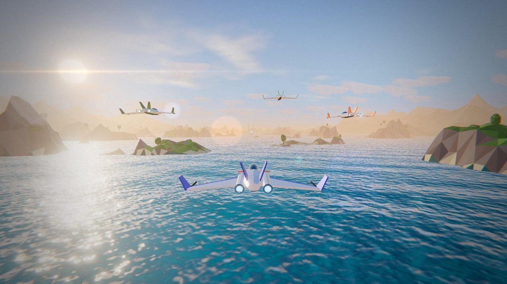
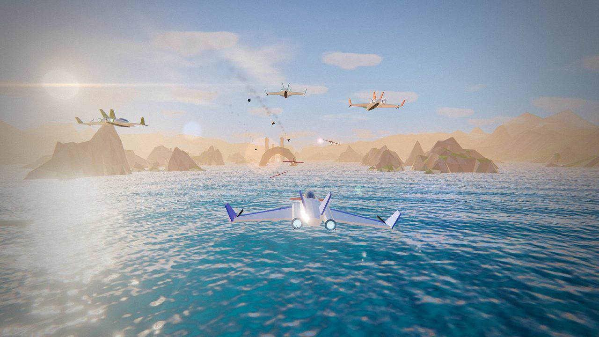
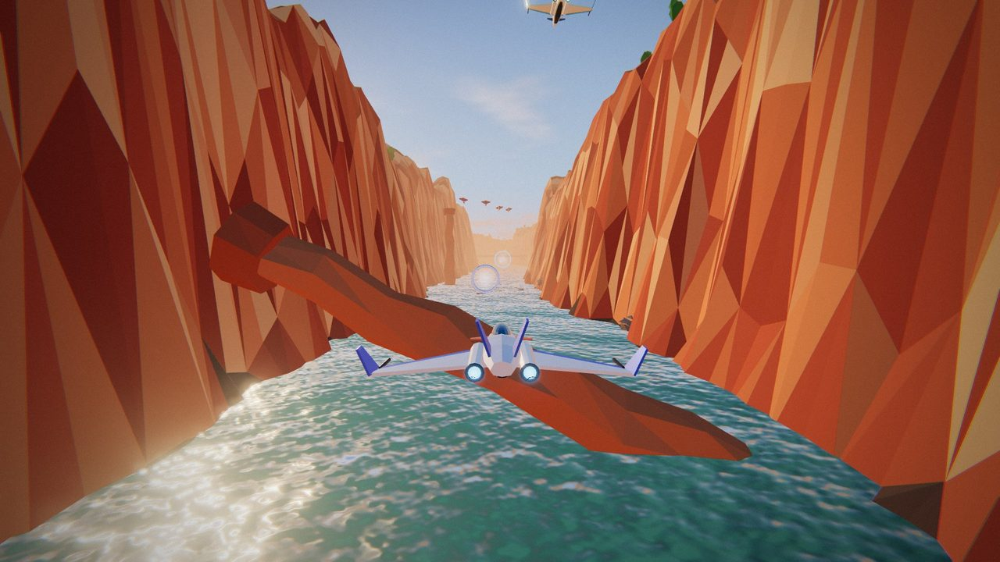
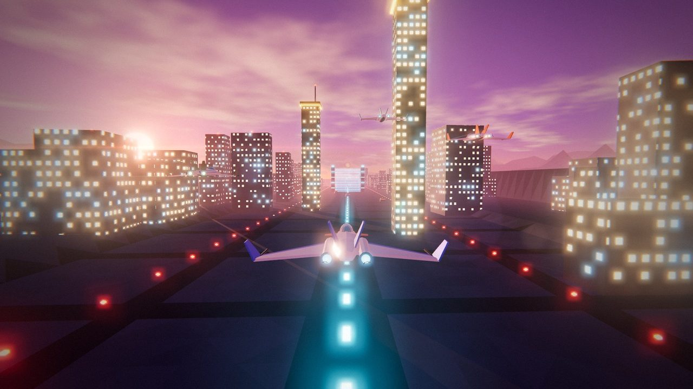
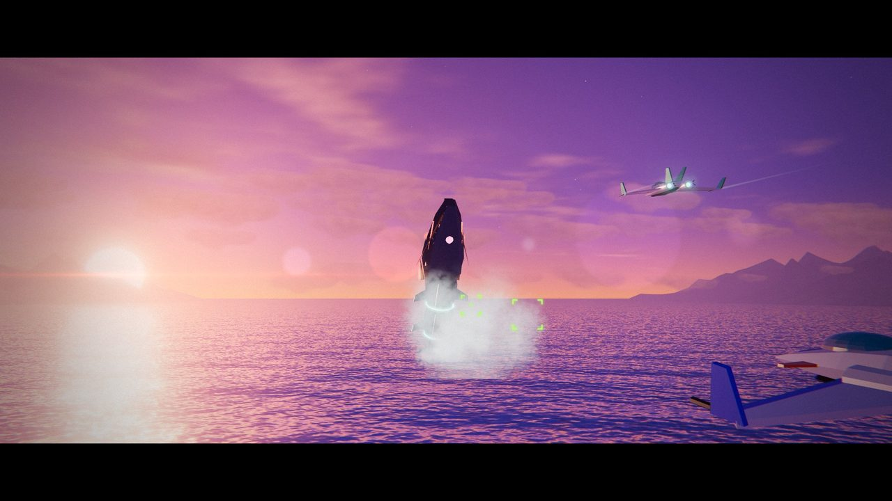
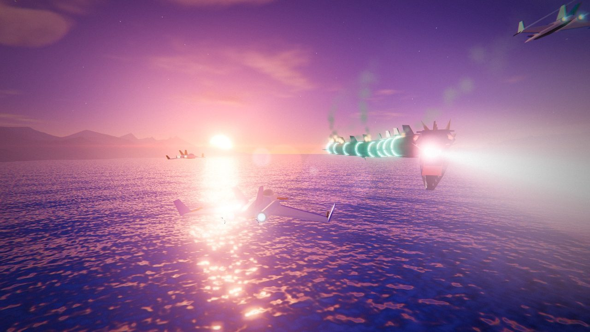

# NOVA LANCER（ノヴァ・ランサー）



**▶ ブラウザで遊ぶ：https://tanuu5.github.io/nova-lancer/**

**Claude Code × Claude Opus 5.5（MAX）** で、依頼 1 回・約 1 時間 40 分で作りました（トークン使用量は[制作について](#制作について)に記載）。

スターフォックス系の 3D レールシューティングを、ブラウザ向けにゼロから作ったオリジナル作品です。
Three.js で描画し、地形・海・空・機体・ボスはすべてコードで生成しています。BGM・効果音・無線のキャラクターボイス（ブリップ音）も Web Audio でその場で合成していて、画像ファイルと音声ファイルは 1 つも使っていません。

| | |
| --- | --- |
|  |  |
|  |  |

## ステージ

**MISSION 01「AZURE COAST」**（約 3 分 ＋ ボス戦）

1. **夕焼けの海**：岩のアーチ、海から突き出た岩柱、編隊を組んで飛んでくる敵機、追われた僚機の救出
2. **赤い岩の峡谷**：蛇行する谷、倒れてくる岩柱、橋の上の砲台、機雷
3. **夜の要塞都市**：ネオンの摩天楼、対空砲火、エネルギーゲート
4. **ボス「ミズチ」**：海中から現れる機械の海竜。背中の砲台を壊すと口の中のコアが弱点として出てきます。掃射ビームや追尾ミサイルに注意



## できること

- チャージショット（長押し）でロックオン、ホーミング弾でまとめて撃墜
- スマートボム、ローリング（敵弾をはじく）、ブースト／ブレーキ
- リング（シールド回復）、ゴールドリング 3 つで最大シールドアップ（さらに 3 つで 1UP）、レーザー強化、チェックポイント
- 僚機 3 人（コタ／ガンテツ／リオ）と司令部（ホウ司令）の無線。喋るたびに顔グラフィックの口が動きます
- 出撃演出、ボス登場の演出、勝利後の旋回カメラ、リザルト画面（ランク・メダル・ハイスコア保存）
- 難易度 3 段階、キーボード／マウス／ゲームパッド／スマホのタッチ操作に対応
- 重い環境では描画解像度を自動で下げます（設定で画質の固定も可能）

## 操作方法

| 操作 | キーボード | ゲームパッド |
| --- | --- | --- |
| 移動 | W A S D / 矢印キー | 左スティック / 十字キー |
| ショット（長押しでチャージ → 離してロックオン弾） | J / Space / Z / 左クリック | A |
| スマートボム（もう一度押すと即起爆） | K / B / X / 右クリック | B / Y |
| ブースト | L / Shift / C | R2 |
| ブレーキ | I / V | L2 / X |
| ローリング（素早く 2 回押す。押し続けると機体を傾けて鋭く旋回） | Q / E（U / O） | L1 / R1 |
| ポーズ | Esc / P | Start |

スマホでは画面左下のドラッグで移動、右下のボタンで各操作をします（タイトル画面の「操作方法」に、タッチ操作の一覧があります）。
音はブラウザの仕様上、最初にキーを押すか画面をクリック（タップ）してから鳴り始めます。

## 制作について

企画・ディレクション：**たぬ**　／　開発：**Claude Code（Claude Opus 5.5・推論レベル MAX）**

最初の依頼はこの一文だけでした。

> Three.js等を使って、それでなくても良いですけど、スターフォックスみたいなゲーム作れます？可能な限りリッチな品質でお願いしたく。

設計からコード、演出、テストまでを Claude がひと続きの作業として進めました。音楽・効果音と、無線の顔グラフィックはサブエージェント 2 体に並行して任せ、本体はその間に 3D 部分を作っています。
画面が表示されていない環境でも検証できるように、フレームを 1 コマずつ進める仕組みと、敵を追いかけて撃つ自動操縦のテスト機を用意し、それで最初から最後まで通しでプレイして確認しました。

### Opus 5.5（MAX）のトークン使用量（ゲーム本体の制作、1 回の依頼ぶん）

| 項目 | 値 |
| --- | --- |
| 制作時間 | 約 1 時間 40 分 |
| API 呼び出し | 312 回（本体 219 ／ 音楽・効果音 51 ／ 顔グラフィック 42） |
| 出力トークン | 約 120 万（うち思考 約 78 万） |
| 処理したトークンの合計 | 約 1 億 4,800 万 |
| └ うちキャッシュからの再読み込み | 約 1 億 4,500 万（98%） |
| └ キャッシュへの書き込み | 約 154 万 |
| ソースコード | 約 9,600 行（JavaScript 16 ファイル ＋ HTML/CSS） |

処理量の大半は「会話の履歴をキャッシュから読み直す」分です。キャッシュの読み込みは通常の入力より大幅に安く扱われるため、見かけの数字ほど重いわけではありません。
この表には、ゲーム完成後に GitHub へ公開する作業のぶんは含めていません。

## 更新履歴

- **2026-09-27**：スマホで、「操作方法」の画面と、クリア時の「MISSION COMPLETE」の表示が崩れていた不具合を修正しました（「MISSION COMPLETE」は PC でも文字が横一列に並んでいました）。あわせて、スマホの「操作方法」ではタッチ操作の説明を先に出すようにし、ミッション開始直後の操作ヒントがミッション名と重ならないようにしました。
- **2026-09-26**：通常弾・敵のレーザー弾・ボスの掃射ビームが、画面に描画されていなかった不具合を修正しました（公開後のプレイで見つかったものです）。あわせて通常弾を少し遅く・長く・太くし、先端を光らせて見やすくしました。
- **2026-09-24**：公開

## 開発

```bash
npm install
npm run build   # index.html（単体で動く 1 ファイル）を生成
npm run dev     # ソースを監視して開発ビルド（ソースマップ付き）
```

`index.html` はビルドで生成されるファイルで、GitHub Pages はこれをそのまま配信しています。three.js ごと 1 ファイルに入っているので、ダウンロードしてダブルクリックでも遊べます（フォントだけは Google Fonts から読み込みます）。

開発ビルド（`npm run dev` か `node tools/build.mjs --dev`）では、ブラウザのコンソールから次のテスト用機能が使えます。

- `__jump(距離)`：ステージの任意の地点から開始（例：`__jump(10600)` でボス直前）
- `__step(フレーム数)`：ゲームを指定したフレーム数だけ進める
- `__bot(フレーム数)`：敵を追いかけて撃つ自動操縦で進める

### ファイル構成

| ファイル | 内容 |
| --- | --- |
| `src/main.js` | 起動処理、ゲームの状態遷移、メインループ、演出カメラ |
| `src/gfx.js` | レンダラー、ポストエフェクト（ブルーム・色収差・レンズフレアなど）、空、大気フォグ、環境マップ |
| `src/world.js` | 進行ルート、地形のストリーミング生成、海、雲、装飾、時間帯ごとの色 |
| `src/ship.js` | 自機のモデル・操縦・ダメージ、追従カメラ |
| `src/weapons.js` | レーザー、チャージショットとロックオン、ボム、敵弾 |
| `src/enemies.js` | 敵のモデル・動き・攻撃 |
| `src/boss.js` | ボス「ミズチ」 |
| `src/wingmen.js` | 僚機 AI |
| `src/props.js` | リング、アイテム、岩のアーチ、岩柱、橋、タワー、エネルギーゲート |
| `src/level.js` | ステージ進行（敵の出現、無線、チュートリアル） |
| `src/hud.js` | HUD、無線ウィンドウ、メニュー、リザルト、タッチ操作 |
| `src/audio.js` | BGM・効果音・キャラクターボイスの合成 |
| `src/portraits.js` | 無線ウィンドウの顔グラフィック（SVG） |
| `src/template.html` | HTML と CSS（ビルド時にスクリプトを埋め込み） |

## クレジット・ライセンス

- コード：MIT License（[LICENSE](LICENSE)）
- 3D 描画：[three.js](https://threejs.org/)（MIT License、`index.html` に同梱）
- フォント：Russo One、Oxanium、M PLUS 1、DotGothic16（Google Fonts、SIL Open Font License）
- 登場キャラクター・機体・楽曲・ステージはすべてこの作品のためのオリジナルです。任天堂『スターフォックス』シリーズとは無関係で、同シリーズの名称・キャラクター・楽曲・素材は使用していません。
